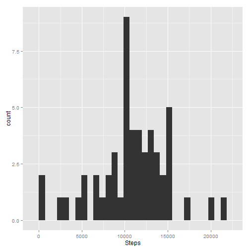
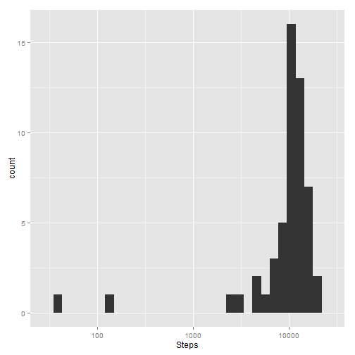
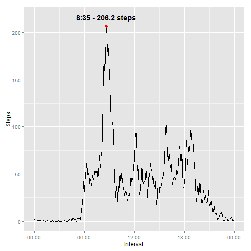
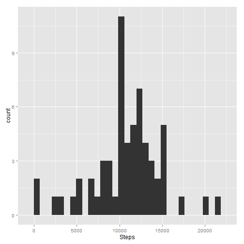
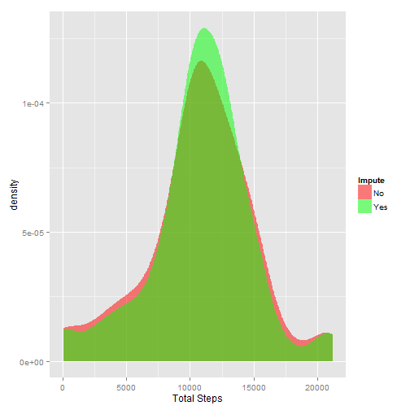
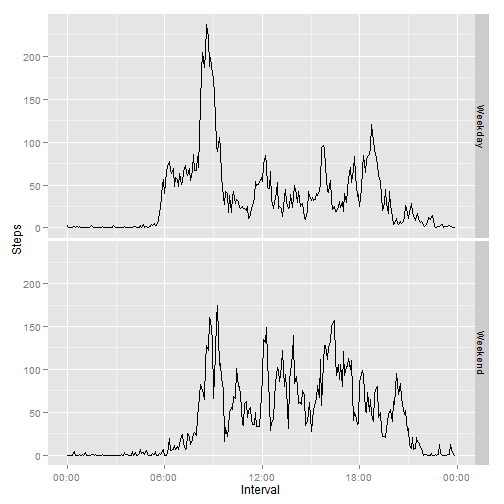

## Loading and processing the data

This analysis will use the following libraries:

- [data.table](http://cran.r-project.org/web/packages/data.table/index.html)
- [lubridate](http://cran.r-project.org/web/packages/lubridate/index.html)
- [ggplot2](http://cran.r-project.org/web/packages/ggplot2/index.html)
- [scales](http://cran.r-project.org/web/packages/scales/index.html)

**Make sure the zip folder where you've stored the zip file referenced in the assignment containing the data is set as your working directory.**


```r
setwd("C:/Users/Jamamel/Google Drive/John Hopkins Data Science/Reproducible Research/Project 1/RepData_PeerAssessment1")

# Unzip data and load data using quick "fread" function from data.table
unzip("activity.zip")
d <- fread('activity.csv')
```

In order to correctly perform the following analysis, we need to apply a few transformations to our data. Most of these are focused on creating "date/time" type variables which are easy to manipulate later on.


```r
# data.table uses specific functions to create IDate type objects which can then be manipulated
# using other data-friendly functionality.
d[,date := as.IDate(date)]

# Create "weekday" variable as factor based on date.
d[,weekday := wday(date,label = T)]

# Create a "time" variable based on the intervals (format = "HH:MM").
intervalmins <- substr(d$interval,nchar(d$interval) - 1,nchar(d$interval))
intervalmins[nchar(intervalmins) == 1] <- paste('0',intervalmins[nchar(intervalmins) == 1], sep = '')
intervalhrs <- substr(d$interval,nchar(d$interval) - 3,nchar(d$interval) - 2)
intervalhrs[intervalhrs == ''] <- '00'
d[, time := as.ITime(paste(intervalhrs, intervalmins, sep = ':'), format = "%H:%M")]
```


```
##        steps       date interval weekday     time
##     1:    NA 2012-10-01        0     Mon 00:00:00
##     2:    NA 2012-10-01        5     Mon 00:05:00
##     3:    NA 2012-10-01       10     Mon 00:10:00
##     4:    NA 2012-10-01       15     Mon 00:15:00
##     5:    NA 2012-10-01       20     Mon 00:20:00
##    ---                                           
## 17564:    NA 2012-11-30     2335     Fri 23:35:00
## 17565:    NA 2012-11-30     2340     Fri 23:40:00
## 17566:    NA 2012-11-30     2345     Fri 23:45:00
## 17567:    NA 2012-11-30     2350     Fri 23:50:00
## 17568:    NA 2012-11-30     2355     Fri 23:55:00
```

##What is mean total number of steps taken per day?


```r
# Calculate total number, mean, and median of steps per day.
dt1 <- d[!is.na(steps), list(sum(steps, na.rm = T),
                             round(mean(steps, na.rm = T),1),
                             quantile(steps, .50, na.rm = TRUE)),
         by = 'date']
setnames(dt1, old = c('V1','V2','V3'), new = c('Steps', 'Mean', 'Median'))
```

Which yields the following distribution of total, mean, and median number of steps per day.


```
##           date Steps Mean Median
##  1: 2012-10-02   126  0.4      0
##  2: 2012-10-03 11352 39.4      0
##  3: 2012-10-04 12116 42.1      0
##  4: 2012-10-05 13294 46.2      0
##  5: 2012-10-06 15420 53.5      0
##  6: 2012-10-07 11015 38.2      0
##  7: 2012-10-09 12811 44.5      0
##  8: 2012-10-10  9900 34.4      0
##  9: 2012-10-11 10304 35.8      0
## 10: 2012-10-12 17382 60.4      0
## 11: 2012-10-13 12426 43.1      0
## 12: 2012-10-14 15098 52.4      0
## 13: 2012-10-15 10139 35.2      0
## 14: 2012-10-16 15084 52.4      0
## 15: 2012-10-17 13452 46.7      0
## 16: 2012-10-18 10056 34.9      0
## 17: 2012-10-19 11829 41.1      0
## 18: 2012-10-20 10395 36.1      0
## 19: 2012-10-21  8821 30.6      0
## 20: 2012-10-22 13460 46.7      0
## 21: 2012-10-23  8918 31.0      0
## 22: 2012-10-24  8355 29.0      0
## 23: 2012-10-25  2492  8.7      0
## 24: 2012-10-26  6778 23.5      0
## 25: 2012-10-27 10119 35.1      0
## 26: 2012-10-28 11458 39.8      0
## 27: 2012-10-29  5018 17.4      0
## 28: 2012-10-30  9819 34.1      0
## 29: 2012-10-31 15414 53.5      0
## 30: 2012-11-02 10600 36.8      0
## 31: 2012-11-03 10571 36.7      0
## 32: 2012-11-05 10439 36.2      0
## 33: 2012-11-06  8334 28.9      0
## 34: 2012-11-07 12883 44.7      0
## 35: 2012-11-08  3219 11.2      0
## 36: 2012-11-11 12608 43.8      0
## 37: 2012-11-12 10765 37.4      0
## 38: 2012-11-13  7336 25.5      0
## 39: 2012-11-15    41  0.1      0
## 40: 2012-11-16  5441 18.9      0
## 41: 2012-11-17 14339 49.8      0
## 42: 2012-11-18 15110 52.5      0
## 43: 2012-11-19  8841 30.7      0
## 44: 2012-11-20  4472 15.5      0
## 45: 2012-11-21 12787 44.4      0
## 46: 2012-11-22 20427 70.9      0
## 47: 2012-11-23 21194 73.6      0
## 48: 2012-11-24 14478 50.3      0
## 49: 2012-11-25 11834 41.1      0
## 50: 2012-11-26 11162 38.8      0
## 51: 2012-11-27 13646 47.4      0
## 52: 2012-11-28 10183 35.4      0
## 53: 2012-11-29  7047 24.5      0
##           date Steps Mean Median
```

When plotted normally, we see the distribution is fairly nicely distributed around 
10765 steps per day. 


```r
# Plot histogram of Total steps per day
hist1 <- ggplot(dt1, aes(x = Steps)) +
  geom_histogram()
hist1
```

```
## stat_bin: binwidth defaulted to range/30. Use 'binwidth = x' to adjust this.
```

 

If we apply a log10 transformation the 2 outlying observations are easy to find even with a histogram.

```r
hist1 + scale_x_log10()
```

```
## stat_bin: binwidth defaulted to range/30. Use 'binwidth = x' to adjust this.
```

 


##What is the average daily activity pattern?


```r
# Calculate average number of steps taken across all days by interval
dt2 <- d[!is.na(steps), list(round(mean(steps, na.rm = T),1)),by = 'time']
setnames(dt2, old = c('time','V1'), new = c('Interval', 'Steps'))

# Identify 5-min interval with highest average number of steps taken across all days.
maxInterval <- match(max(dt2$Steps),dt2$Steps)
maxIntLab <-  paste(hour(dt2$Interval[maxInterval]),
                    ':',
                    minute(dt2$Interval[maxInterval]),
                    ' - ',
                    dt2$Steps[maxInterval],
                    ' steps',sep = '')

# Plot time series of average steps taken across days (y-axis) by interval (x-axis)
dt2[, Interval := as.POSIXct(strftime(Interval, format="%H:%M"), format="%H:%M")]
```

```
##                 Interval Steps
##   1: 2014-11-16 00:00:00   1.7
##   2: 2014-11-16 00:05:00   0.3
##   3: 2014-11-16 00:10:00   0.1
##   4: 2014-11-16 00:15:00   0.2
##   5: 2014-11-16 00:20:00   0.1
##  ---                          
## 284: 2014-11-16 23:35:00   4.7
## 285: 2014-11-16 23:40:00   3.3
## 286: 2014-11-16 23:45:00   0.6
## 287: 2014-11-16 23:50:00   0.2
## 288: 2014-11-16 23:55:00   1.1
```

```r
lines2 <- ggplot(dt2, aes(x = Interval, y = Steps, group=1)) +
  geom_line() +
  geom_point(aes(x = dt2$Interval[maxInterval], y = dt2$Steps[maxInterval]),colour = 'red', size = 3) +
  scale_x_datetime(labels = date_format("%H:%M")) +
  annotate("text", label = maxIntLab, 
           x = dt2$Interval[maxInterval], 
           y = dt2$Steps[maxInterval] + 10, 
           size = 5,fontface = "bold")
lines2
```

 

Clearly, most of the walking takes place in the mornings, pressumably on this person's way to work or as part of their morning routine. The highest activity is concentrated around 8:35 - 206.2 steps.


##Imputing missing values


```r
# Calculate number of observations with missing values (NA) in "steps"
nmissing <- nrow(d[,d[is.na(steps)]])
```

There are 2304 observations without a record of the number of steps taken across that interval.

We calculate the average number of steps taken by weekday & interval to impute said missing values.


```r
# To impute said missing values, we calculate the average number of steps taken by weekday & interval
# These will be the values to impute.
auxdt3 <- d[, list(round(mean(steps, na.rm = T),1)),by = c('weekday','time')]
setnames(auxdt3,'V1','Steps')
dt3 <- copy(d)
dt3[,steps := as.numeric(steps)]
setkeyv(auxdt3,c('weekday','time'))
dt3[is.na(steps),steps := auxdt3[dt3[is.na(steps),c('weekday','time'),with = F],'Steps',with = F]]


# Calculate total number, mean, and median of steps per day.
dt3.1 <- dt3[!is.na(steps), list(sum(steps),
                             round(mean(steps),1),
                             quantile(steps, .50,)),
         by = 'date']
setnames(dt3.1, old = c('V1','V2','V3'), new = c('Steps', 'Mean', 'Median'))

# Create histogram of Total steps per day
hist3 <- ggplot(dt3.1, aes(x = Steps)) +
  geom_histogram()
```

When plotted normally, we see the distribution is fairly nicely distributed around 
11015 steps per day instead of 10765 steps before imputation.It would appear then that imputation has helped concentrate our data and reduced its variability.


```
##           date   Steps Mean Median
##  1: 2012-10-01  9975.4 34.6   8.20
##  2: 2012-10-02   126.0  0.4   0.00
##  3: 2012-10-03 11352.0 39.4   0.00
##  4: 2012-10-04 12116.0 42.1   0.00
##  5: 2012-10-05 13294.0 46.2   0.00
##  6: 2012-10-06 15420.0 53.5   0.00
##  7: 2012-10-07 11015.0 38.2   0.00
##  8: 2012-10-08  9975.4 34.6   8.20
##  9: 2012-10-09 12811.0 44.5   0.00
## 10: 2012-10-10  9900.0 34.4   0.00
## 11: 2012-10-11 10304.0 35.8   0.00
## 12: 2012-10-12 17382.0 60.4   0.00
## 13: 2012-10-13 12426.0 43.1   0.00
## 14: 2012-10-14 15098.0 52.4   0.00
## 15: 2012-10-15 10139.0 35.2   0.00
## 16: 2012-10-16 15084.0 52.4   0.00
## 17: 2012-10-17 13452.0 46.7   0.00
## 18: 2012-10-18 10056.0 34.9   0.00
## 19: 2012-10-19 11829.0 41.1   0.00
## 20: 2012-10-20 10395.0 36.1   0.00
## 21: 2012-10-21  8821.0 30.6   0.00
## 22: 2012-10-22 13460.0 46.7   0.00
## 23: 2012-10-23  8918.0 31.0   0.00
## 24: 2012-10-24  8355.0 29.0   0.00
## 25: 2012-10-25  2492.0  8.7   0.00
## 26: 2012-10-26  6778.0 23.5   0.00
## 27: 2012-10-27 10119.0 35.1   0.00
## 28: 2012-10-28 11458.0 39.8   0.00
## 29: 2012-10-29  5018.0 17.4   0.00
## 30: 2012-10-30  9819.0 34.1   0.00
## 31: 2012-10-31 15414.0 53.5   0.00
## 32: 2012-11-01  8212.6 28.5   7.75
## 33: 2012-11-02 10600.0 36.8   0.00
## 34: 2012-11-03 10571.0 36.7   0.00
## 35: 2012-11-04 12277.4 42.6  23.85
## 36: 2012-11-05 10439.0 36.2   0.00
## 37: 2012-11-06  8334.0 28.9   0.00
## 38: 2012-11-07 12883.0 44.7   0.00
## 39: 2012-11-08  3219.0 11.2   0.00
## 40: 2012-11-09 12359.6 42.9  15.50
## 41: 2012-11-10 12536.0 43.5  16.40
## 42: 2012-11-11 12608.0 43.8   0.00
## 43: 2012-11-12 10765.0 37.4   0.00
## 44: 2012-11-13  7336.0 25.5   0.00
## 45: 2012-11-14 11790.2 40.9  12.65
## 46: 2012-11-15    41.0  0.1   0.00
## 47: 2012-11-16  5441.0 18.9   0.00
## 48: 2012-11-17 14339.0 49.8   0.00
## 49: 2012-11-18 15110.0 52.5   0.00
## 50: 2012-11-19  8841.0 30.7   0.00
## 51: 2012-11-20  4472.0 15.5   0.00
## 52: 2012-11-21 12787.0 44.4   0.00
## 53: 2012-11-22 20427.0 70.9   0.00
## 54: 2012-11-23 21194.0 73.6   0.00
## 55: 2012-11-24 14478.0 50.3   0.00
## 56: 2012-11-25 11834.0 41.1   0.00
## 57: 2012-11-26 11162.0 38.8   0.00
## 58: 2012-11-27 13646.0 47.4   0.00
## 59: 2012-11-28 10183.0 35.4   0.00
## 60: 2012-11-29  7047.0 24.5   0.00
## 61: 2012-11-30 12359.6 42.9  15.50
##           date   Steps Mean Median
```

```
## stat_bin: binwidth defaulted to range/30. Use 'binwidth = x' to adjust this.
```

 

Overlaying the 2 distributions (before and after imputation) of total steps across intervals by day we confirm imputation has caused the variance to shrink, increasing our distribution kurtosis.


```r
dt1[,Impute := factor(1,levels = 1:2,labels = c('No','Yes'))]
dt3.1[,Impute := factor(2,levels = 1:2,labels = c('No','Yes'))]

compdt <- rbind(dt3.1,dt1)
comphist <- ggplot(compdt,aes(x = Steps,colour = Impute,fill = Impute)) +
  geom_density(color = NA,alpha = 0.5) +
  xlab("Total Steps") + scale_fill_manual(values=c(No = 'red',Yes = 'green'))
```
 


##Are there differences in activity patterns between weekdays and weekends?


```r
# Create "daytype" factor, identifying weekend vs. week days
dt3[,daytype := factor(ifelse(weekday %in% c('Sun','Sat'),'Weekend','Weekday'))]

# Calculate average number of steps taken across all days by interval and daytype
dt4 <- dt3[!is.na(steps), list(round(mean(steps, na.rm = T),1)),by = c('time','daytype')]
setnames(dt4, old = c('time','V1'), new = c('Interval', 'Steps'))

# Plot time series of average steps taken across days (y-axis) by interval (x-axis), using daytype
# as panel divider.
dt4[, Interval := as.POSIXct(strftime(Interval, format="%H:%M"), format="%H:%M")]
lines4 <- ggplot(dt4, aes(x = Interval, y = Steps, group=1)) +
  geom_line() +
  scale_x_datetime(labels = date_format("%H:%M")) +
  facet_grid(daytype ~ .)
```

```
##                 Interval daytype Steps
##   1: 2014-11-16 00:00:00 Weekday   2.3
##   2: 2014-11-16 00:05:00 Weekday   0.4
##   3: 2014-11-16 00:10:00 Weekday   0.2
##   4: 2014-11-16 00:15:00 Weekday   0.2
##   5: 2014-11-16 00:20:00 Weekday   0.1
##  ---                                  
## 572: 2014-11-16 23:35:00 Weekend  12.6
## 573: 2014-11-16 23:40:00 Weekend   6.7
## 574: 2014-11-16 23:45:00 Weekend   1.9
## 575: 2014-11-16 23:50:00 Weekend   0.0
## 576: 2014-11-16 23:55:00 Weekend   0.0
```

 
